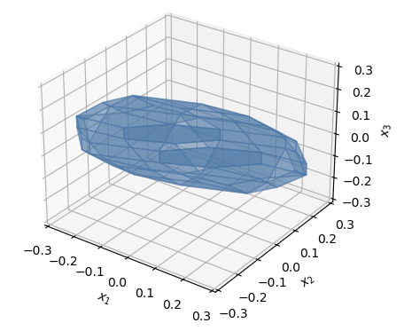

Examples
========

Here we list some examples.

.. _visualization:

Visualization
-------------

We can do visualizations of polytopes, ellipsoids, and subspaces in :math:`n \in \{1,2,3\}` dimensions, as follows::

    A = ...
    b = ...
    P = geo.Polytope(A, b)

    # Plot the polytope
    fig, ax = P.plot()
    fig.suptitle("Plotting a polytope")
    plt.show()

**Result:**

Robust MPC
----------

To retrieve a list of random ingredients,
you can use the ``lumache.get_random_ingredients()`` function: